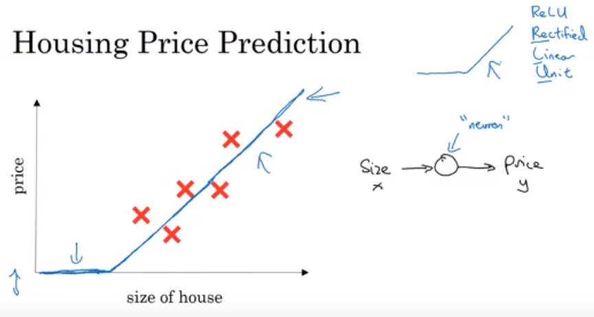

# Notes for Deep Learning by Andrew Ng  
### What is Deep Learning?  
- What we will learn: 1. Neural Networks and Deep Learning 2. Improving Deep Neural Networks: Hyperparameter tuning, Regularization and Optimization 3. Structuring your Machine Learning project 4. Convolutional Neural Networks (CNN) 5. Natural Language Processing: Building sequence models (Recurrent Neural Networks and Long Short Term Memory)  

### What is Neural Network  
- The simplest neural network, just one single neuron, giving a X and will have the correspoding Y. This classified line is called Rectified Linear Unit (ReLU), rectified means that the value is larger or equal to 0.  
   

- More complicated one, we have these kinds of considerations and some of them will form a new consideration. Afterwards, these considerations will converage to the output.  
  

- If we put four inputs (input features) and the combine whatever they want, the input is called `input layer` and the hidden layer is also called `dense connected layer` and the output is `output layer`. By giving many training sets including the input features and the corresponding output to this model to learn, the neural network will figure out the best function mapping x to y.  
- Supervised Learning: giving the x and the mapping y to this neural network.