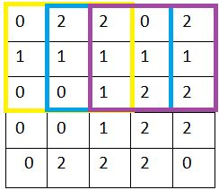
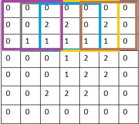

# Notes for Machine Learning  
- **SVM(支持向量机)** 分类器的原理是利用“分类超平面”来实现数据分类。在利用“分类超平面”对数据进行划分时，遵循“间距最大”原则。如果分类3维数据，我们就使用一个平面来分割数据。如果分类4维数据，我们将会使用一个体来分割数据。以此类推，如果分类1024维数据，我们将使用1023维平面来分割数据。`SVM`是一个由分类超平面定义的判别分类器。也就是说给定一组带标签的训练样本，算法将会输出一个最优超平面对新样本(测试样本)进行分类。这也是监督类型机器学习的特点，即，把一堆带有标签的数据输入到机器中，让机器根据给定的数据计算出规则，再利用这个规则，去对未知数据进行分类。说白了，就是先积累几年工作经验，然后去工作。  
- **HOG**的全称是`Histogram of Oriented Gradient`，即方向梯度直方图。它是一种在计算机视觉和图像处理中用来进行物体检测的特征描述子。它通过计算和统计图像局部区域的梯度方向直方图来构成特征。Hog特征结合SVM分类器已经被广泛应用于图像识别中，尤其在行人检测中获得了极大的成功。优点：与其他的特征描述方法相比，HOG有很多优点。首先，由于HOG是在图像的局部方格单元上操作，所以它对图像几何的和光学的形变都能保持很好的不变性，这两种形变只会出现在更大的空间领域上。其次，在粗的空域抽样、精细的方向抽样以及较强的局部光学归一化等条件下，只要行人大体上能够保持直立的姿势，可以容许行人有一些细微的肢体动作，这些细微的动作可以被忽略而不影响检测效果。因此HOG特征是特别适合于做图像中的人体检测的。  
- **k-近邻算法**机器学习算法是k-近邻算法（kNN)，它的工作原理是：存在一个样本数据集合，也称作训练样本集，并且样本集中每个数据都存在标签，即我们知道样本集中每一数据与所属分类的对应关系。输入没有标签的新数据后，将新数据的每个特征与样本集中数据对应的特征进行比较，然后算法提取样本集中特征最相似数据（最近邻）的分类标签。一般来说，我们只选择样本数据集中前*k*个最相似的数据，这就是k-近邻算法中*k*的出处，通常*k*是不大于20的整数。最后，选择*k*个最相似数据中出现次数最多的分类，作为新数据的分类。  
- 最普通的**卷积神经网络CNN**如图所示：  
  

CNN主要由三种模块构成：卷积层、采样层和全连接层。可以理解为通过第一个卷积层提取最初特征，输出特征图（feature map），通过第一个采样层对最初的特征图（feature map ）进行特征选择；去除多余特征,重构新的特征图；第二个卷积层是对上一层的采样层的输出特征图（feature map）进行二次特征提取；第二个采样层也对上层输出进行二次特征选择；全连接层就是根据得到的特征进行分类。  
- **卷积**：原始图像通过与卷积核的数学运算，可以提取出图像的某些指定特征（features)；不同卷积核，提取的特征也是不一样的；提取的特征一样，不同的卷积核，效果也不一样。对于**卷积核**来说，比如一个3x3的卷积核，里面的值称为**权重weights**，也就是神经元的权值。将卷积核与输入图片矩阵进行点乘，就是就代表卷积核里的权重单独对相应位置的Pixel进行作用，然后再把得到的值相加。进行卷积时，卷积核窗口移动要按顺序从左到右，从上到下，步长stride可以自己设定。若不按顺序则会导致图片里的物体位置排列不正确。图片pixel外围圈可以补0（zero padding）。如图所示：  
  

同样是stride x=1 的情况下，补0比原来没有添0 的情况下进行卷积，从左到右，从上到下都多赚了2次卷积，这样第一层卷积层输出的特征图（feature map）仍然为5x5，和输入图片的大小一致而没有添0的第一层卷积层输出特征图大小为3x3。这样可以带来好处：我们获得的更多更细致的特征信息，上面那个例子我们就可以获得更多的图像边缘信息；我们可以控制卷积层输出的特征图的size，从而可以达到控制网络结构的作用，还是以上面的例子，如果没有做zero-padding以及第二层卷积层的卷积核仍然是3x3, 那么第二层卷积层输出的特征图就是1x1，CNN的特征提取就这么结束了。同样的情况下加了zero-padding的第二层卷积层输出特征图仍然为5x5，这样我们可以再增加一层卷积层提取更深层次的特征。